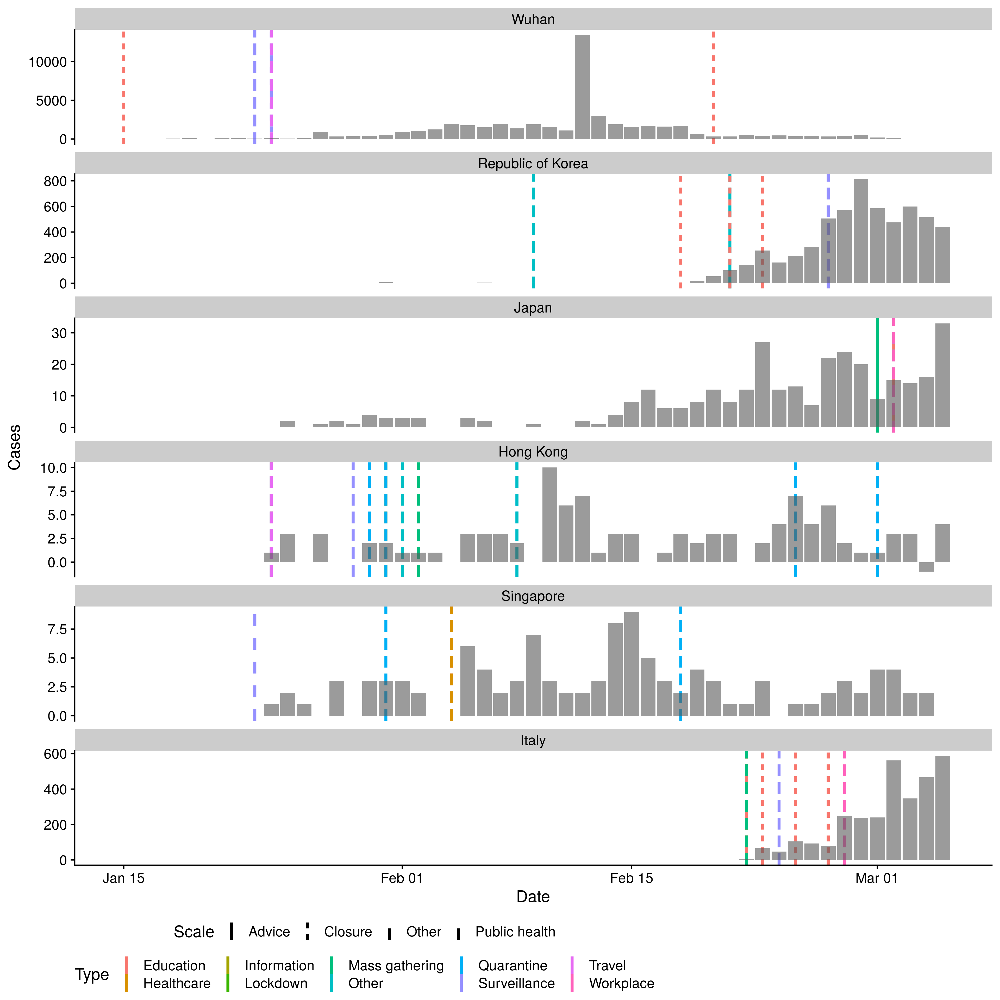

```{r setup, include=FALSE}
knitr::opts_chunk$set(echo = FALSE, warning = FALSE, message = FALSE)

library(dplyr)
library(magrittr)
library(readr)
library(flextable)
```

# Summary

- School closures, remote working and quarantine have been the most common social
distancing interventions applied for COVID-19 to date.

- Symptomatic COVID-19 cases thus far have been disproportionately reported amongst
the elderly population compared to children - it is unclear whether school closures will
have the same benefits as have been shown for pandemic influenza.

- Travel restrictions have been widely implemented and found to be effective at slowing
geographic spread by a few days and reducing initial case numbers.

- Timely implementation of control measures will have a greater impact on the COVID-19
epidemic, but the early lifting of control measures could lead to an increase in case
numbers, as shown for influenza control. At this stage, data on this for COVID-19 are still
sparse.

- A number of non-pharmaceutical interventions have been implemented at this point of
time, most stringently in China. The assessment of these measures has been limited,
especially concerning more recent interventions such as school closures. In many
countries, it is too early to evaluate the effect of interventions.

- Empirical and modelling studies of pandemic influenza suggest that measures
implemented at an earlier stage of the epidemic (compared to later stages), either locally
or nationally, are likely to have greater impact on reducing the potential epidemic size.

# Background

## Measures in use

Social distancing (SD) measures can be effective control measures in outbreak settings. These can be broadly defined as: i) isolation, the separation of ill individuals from non-infected individuals; ii) quarantine, the separation of individuals who have been assumed to be exposed and; iii) community containment, an intervention applied to an entire community aimed at reducing contacts and movements [@wilder]. However, the timing and duration of SD interventions will impact its effectiveness. Studies from pandemic influenza have emphasised the restricted benefits of time-limited interventions, with the potential reduction in mortality by up to 30% being eroded if the control was applied too late or lifted too early [@bootsma].

SD interventions have been implemented to different degrees by countries affected by the COVID-19 epidemic. Interventions have been most stringent in Hubei province, where the effective lockdown of cities have affected 40-60 million residents in Hubei province and Wuhan City in particular [@wu2020characteristics; @WHO]. Across other provinces in China, huge public health efforts including quarantine, cancellation of large gatherings, and travel restrictions have been implemented. Outside of mainland China, countries and regions worst affected by COVID-19 have or have started to introduce SD interventions in efforts to contain and limit the spread of COVID-19. For example, Singapore has implemented extensive contact tracing and quarantine measures for confirmed cases.

The most common SD measures in Hubei province (China) and the eight countries and regions reporting the highest COVID-19 case numbers outside of mainland China to date, were school closures followed by remote working and quarantine (see appendix for most common non-SD measures). Table 1 summarises the SD intervention and the potential effects on mixing patterns.

Figure 1 shows the timing of interventions in different countries and regions relative to the reported cases over time. There has been substantial variation in interventions adopted. Some countries and regions such as the USA have implemented reactive and selective local school closures only, whereas Hong Kong, for similar case counts, has introduced a large number of voluntary (e.g. advice on avoiding crowded places) and mandatory (e.g. quarantine, contact tracing, wide-scale proactive school closures) SD measures. It is important to note that while the figure shows interventions by specific date of introduction, most countries and regions shown have implemented contact tracing and quarantine of cases in response to the first imported cases from Hubei, China (Japan, Thailand, South Korea, USA, Singapore since mid- to late-January). Other countries have implemented interventions in response to a large number of newly reported cases (Italy and Iran) more recently (supplementary table 3).

# Impact of interventions

A range of non-pharmaceutical interventions (extension of school holidays, flexible working hours and remote working, quarantine of travellers from mainland China, and flight restrictions) have been implemented in Hong Kong resulting in behaviour change of the general public (measured through telephone surveys). Using influenza incidence rates as a proxy, Cowling et al showed that influenza transmission declined substantially (uncertainty range 24 - 53% reduction in transmissibility) after introduction of control measures and changes in population behaviours (avoidance of crowded places and consistent use of face masks) in early February. However, it is unclear how long Hong Kong will be able to sustain these measures. It is difficult to disentangle the most effective interventions; however, the combination of isolation, contact tracing, and quarantine appear to be "working" and Hong Kong has not observed infections in healthcare workers to date (Cowling, personal communication). 

Assessing travel restrictions, Tian et al. examined the impact of quarantine and movement restrictions in Wuhan. They found that travel restrictions slowed the rate of spread between cities, delaying the arrival by approximately 2.9 days (95%CI: 2.5-3.3 days) [@tian2020early]. They also found that measures implemented pre-emptively could reduce cases in the first week of introduction by 37%. Further travel restrictions were examined by Anzai et al. who suggest that, due to the lockdown of Wuhan city, 226 cases were prevented from global exportation (95% CI 86, 449) corresponding to a reduction in exported cases of 70% [@anzai2020assessing]. Lai et al. found further support for travel restrictions and non-pharmaceutical interventions (NPIs) in general, estimating that without them there would have been a 67-fold increase in cases in Baidu. They also highlighted that had interventions been applied earlier, for example by 3 weeks, the effects would have been even greater, leading to a 95% reduction in cases [@lai2020effect].

**Table 1: Summary of social distancing interventions implemented in Wuhan City, China and the 8 countries or regions1 reporting the highest number of COVID-19 cases. Countries and regions considered here are: Hong Kong, Italy, Japan, Singapore, South Korea and Wuhan. Many countries have been implementing quarantine measures of travellers. [The number refers to countries or regions where we have identified exact dates of implementation].**
```{r table 1}
df <- readr::read_csv("../Tables/Table_1.csv")

df %>% flextable::flextable(cwidth = 1.5) %>% 
  flextable::theme_zebra() %>%
  flextable::merge_v(j = "Postulated mechanism of impact" ) %>%
  fontsize(size = 10)
```


```{r fig1, fig.cap="Figure 1: Number of cases by date of report for the 6 regions/countries with the highest number of cases outside of mainland China and Wuhan City as reported by WHO (taken from the WHO situational reports and Hubei Health Commission press releases). Note cases in Japan do not include the international conveyance. Each line represents the date of implementation of a social distancing measure. Note that some countries/regions had travel advice in place in response to the growing epidemic in China before the report of the first case in-country/ region. See supplementary information for NPIs other than SD."}



```

# References

<div id="refs"></div>

# Supplementary information

## Transmissability over time

ADD FIGURE

## Interventions not realted to social distancing

**Supplemental table 1: Table of common non-social distancing interventions in the eight countries/regions with the highest number of cases outside of mainland China and Wuhan City, China.**
```{r table S1}
df <- readr::read_csv("../Tables/Table_S1.csv")

df %>% flextable::flextable(cwidth = 3) %>% 
  flextable::theme_zebra() %>%
  fontsize(size = 10)
```


```{r figs1, fig.cap="Supplemental figure 1: Cases numbers by date of report for the ten countries with the highest number of cases outside of mainland China as reported by WHO (taken from the WHO situational reports and from Hubei Health Commission press releases). Note cases in Japan do not include the international conveyance. Bar fill is related to the introduction of non-pharmaceutical interventions other than social distancing."}


```

## Data Dictionary

a) Contact Tracing:  Identifying individuals who might have been in contact with a confirmed case 

b) Isolation: Separation of ill persons with contagious diseases from non-infected persons 

c) Quarantine: Restriction of persons who are presumed to have been exposed to a contagious disease but are not ill, either because they did not become infected or because they are still in the incubation period 

d) School Closures. Closure of schools across a region or nation-wide. This is distinct from reactive closure of schools in response to an identified case.

e) Workplace Closure and Measures. Closure of workplaces and advisories to work remotely.

f) Crowding: Advisories to avoid crowded places such as concerts. This includes mandatory cancellations of mass gatherings such as conferences, weddings, funerals etc.

g) University closure. Regional or nationwide closure of universities 

