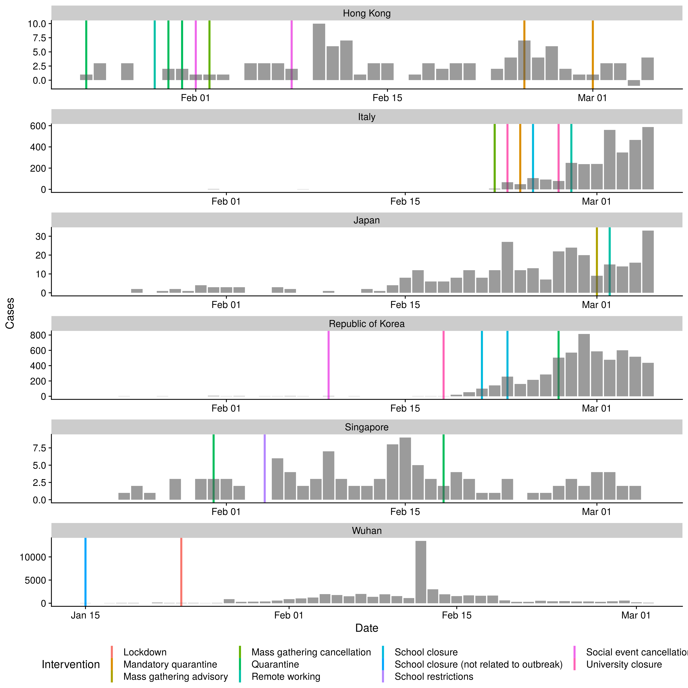
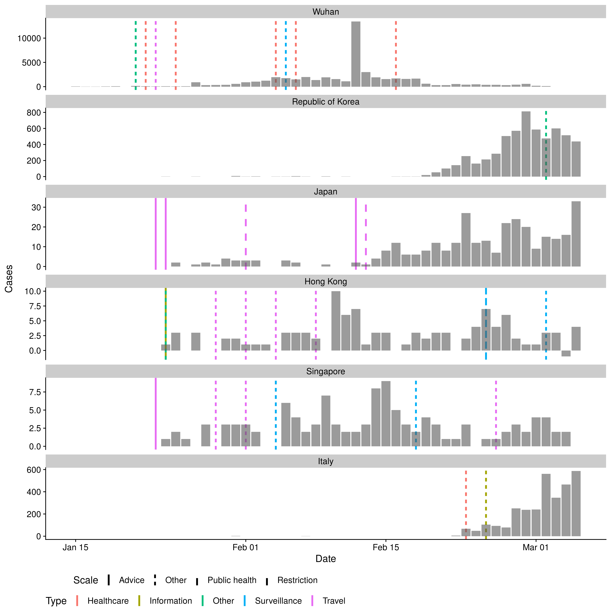
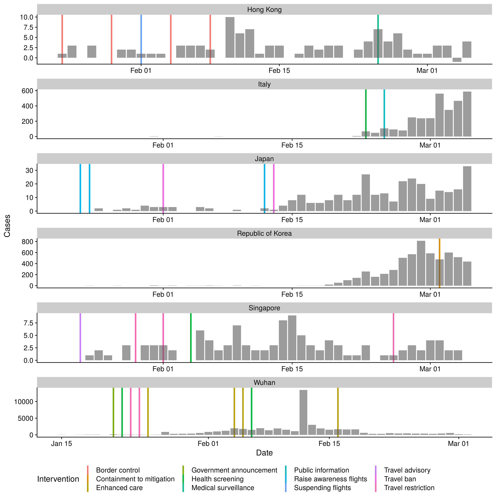

Package
-------

Extract variables of potential interest from linelist
-----------------------------------------------------

    extracted_linelist <- readr::read_csv("raw-data/linelist.csv") %>%
      dplyr::as_tibble() %>%
      dplyr::select(country, city, province, date_confirmation, travel_history_location) %>%
      dplyr::mutate(import_status = dplyr::if_else(is.na(travel_history_location) |
                                                     travel_history_location == "", "local", "imported"))

    ## Parsed with column specification:
    ## cols(
    ##   .default = col_character(),
    ##   ID = col_double(),
    ##   `wuhan(0)_not_wuhan(1)` = col_double(),
    ##   latitude = col_double(),
    ##   longitude = col_double(),
    ##   data_moderator_initials = col_logical(),
    ##   V34 = col_logical(),
    ##   V35 = col_logical(),
    ##   V36 = col_logical(),
    ##   V37 = col_logical(),
    ##   V38 = col_logical(),
    ##   V39 = col_logical(),
    ##   V40 = col_logical(),
    ##   V41 = col_logical()
    ## )

    ## See spec(...) for full column specifications.

    ## Warning: 656 parsing failures.
    ##  row                     col           expected actual                    file
    ## 5835 data_moderator_initials 1/0/T/F/TRUE/FALSE     SL 'raw-data/linelist.csv'
    ## 5836 data_moderator_initials 1/0/T/F/TRUE/FALSE     SL 'raw-data/linelist.csv'
    ## 5837 data_moderator_initials 1/0/T/F/TRUE/FALSE     SL 'raw-data/linelist.csv'
    ## 5838 data_moderator_initials 1/0/T/F/TRUE/FALSE     SL 'raw-data/linelist.csv'
    ## 5839 data_moderator_initials 1/0/T/F/TRUE/FALSE     SL 'raw-data/linelist.csv'
    ## .... ....................... .................. ...... .......................
    ## See problems(...) for more details.

Estimate fraction that are imported
-----------------------------------

-   Based on linelist data alone. Only countries with at least 20 total
    cases present are shown.

<!-- -->

    ## Based on linelist data
    prop_cases_imported <- extracted_linelist %>%
      dplyr::count(country, import_status) %>%
      tidyr::spread(key = "import_status", value = "n") %>%
      dplyr::mutate_at(.vars = c("local", "imported"), ~ replace(., is.na(.), 0)) %>%
      dplyr::mutate(linelist_total = imported + local,
                    frac_imported = round(imported / linelist_total, 2)) %>%
      dplyr::filter(linelist_total >= 15, !country %in% c("", "China")) %>%
      dplyr::arrange(desc(frac_imported))

-   Based on linelist data and WH0 sit reps

<!-- -->

    countries <- prop_cases_imported$country
    names(countries) <- prop_cases_imported$country

    countries["South Korea"] <- "RepublicofKorea"
    countries["United Arab Emirates"] <- "UnitedArabEmirates"
    countries["United States"] <- "UnitedStatesofAmerica"
    countries["Vietnam"] <- "VietNam"
    countries["United Kingdom"] <- "UnitedKingdom"
    countries <- countries[!is.na(countries)]

    country_cases <- countries %>% 
      purrr::map_dfr(~ get_who_cases(., daily = TRUE), .id = "country")

    total_cases <- country_cases %>% 
      dplyr::count(country, wt = cases) %>% 
      dplyr::rename(who_total = n)

    prop_cases_imported_who <- prop_cases_imported %>% 
      dplyr::full_join(total_cases, by = "country") %>% 
      dplyr::mutate(who_frac_imported = round(imported / who_total, 2)) %>% 
      dplyr::arrange(desc(who_frac_imported)) %>% 
      ## Drop USA and thailand
      dplyr::filter(!country %in% c("United States", "Thailand", "Iran"))

-   Summarise and report

<!-- -->

    tab_cases_imported <- prop_cases_imported_who %>% 
      dplyr::select(Country = country, Cases = who_total, `Fraction imported (linelist only)` = frac_imported,
                    `Fraction imported (WHO sit reps)` = who_frac_imported)

    saveRDS(tab_cases_imported, "output-data/cases_imported.rds")

    knitr::kable(tab_cases_imported)

<table>
<thead>
<tr class="header">
<th style="text-align: left;">Country</th>
<th style="text-align: right;">Cases</th>
<th style="text-align: right;">Fraction imported (linelist only)</th>
<th style="text-align: right;">Fraction imported (WHO sit reps)</th>
</tr>
</thead>
<tbody>
<tr class="odd">
<td style="text-align: left;">Vietnam</td>
<td style="text-align: right;">17</td>
<td style="text-align: right;">0.69</td>
<td style="text-align: right;">0.65</td>
</tr>
<tr class="even">
<td style="text-align: left;">Kuwait</td>
<td style="text-align: right;">58</td>
<td style="text-align: right;">1.00</td>
<td style="text-align: right;">0.64</td>
</tr>
<tr class="odd">
<td style="text-align: left;">Bahrain</td>
<td style="text-align: right;">49</td>
<td style="text-align: right;">1.00</td>
<td style="text-align: right;">0.41</td>
</tr>
<tr class="even">
<td style="text-align: left;">Canada</td>
<td style="text-align: right;">51</td>
<td style="text-align: right;">0.75</td>
<td style="text-align: right;">0.29</td>
</tr>
<tr class="odd">
<td style="text-align: left;">Singapore</td>
<td style="text-align: right;">130</td>
<td style="text-align: right;">0.34</td>
<td style="text-align: right;">0.25</td>
</tr>
<tr class="even">
<td style="text-align: left;">Australia</td>
<td style="text-align: right;">62</td>
<td style="text-align: right;">0.88</td>
<td style="text-align: right;">0.24</td>
</tr>
<tr class="odd">
<td style="text-align: left;">Iraq</td>
<td style="text-align: right;">44</td>
<td style="text-align: right;">0.44</td>
<td style="text-align: right;">0.18</td>
</tr>
<tr class="even">
<td style="text-align: left;">United Arab Emirates</td>
<td style="text-align: right;">45</td>
<td style="text-align: right;">0.35</td>
<td style="text-align: right;">0.16</td>
</tr>
<tr class="odd">
<td style="text-align: left;">Malaysia</td>
<td style="text-align: right;">83</td>
<td style="text-align: right;">0.65</td>
<td style="text-align: right;">0.13</td>
</tr>
<tr class="even">
<td style="text-align: left;">India</td>
<td style="text-align: right;">31</td>
<td style="text-align: right;">0.14</td>
<td style="text-align: right;">0.13</td>
</tr>
<tr class="odd">
<td style="text-align: left;">Japan</td>
<td style="text-align: right;">408</td>
<td style="text-align: right;">0.07</td>
<td style="text-align: right;">0.13</td>
</tr>
<tr class="even">
<td style="text-align: left;">Netherlands</td>
<td style="text-align: right;">128</td>
<td style="text-align: right;">0.67</td>
<td style="text-align: right;">0.09</td>
</tr>
<tr class="odd">
<td style="text-align: left;">United Kingdom</td>
<td style="text-align: right;">167</td>
<td style="text-align: right;">0.59</td>
<td style="text-align: right;">0.06</td>
</tr>
<tr class="even">
<td style="text-align: left;">Spain</td>
<td style="text-align: right;">374</td>
<td style="text-align: right;">0.44</td>
<td style="text-align: right;">0.06</td>
</tr>
<tr class="odd">
<td style="text-align: left;">Norway</td>
<td style="text-align: right;">113</td>
<td style="text-align: right;">0.25</td>
<td style="text-align: right;">0.04</td>
</tr>
<tr class="even">
<td style="text-align: left;">Germany</td>
<td style="text-align: right;">639</td>
<td style="text-align: right;">0.32</td>
<td style="text-align: right;">0.03</td>
</tr>
<tr class="odd">
<td style="text-align: left;">France</td>
<td style="text-align: right;">613</td>
<td style="text-align: right;">0.20</td>
<td style="text-align: right;">0.01</td>
</tr>
<tr class="even">
<td style="text-align: left;">Italy</td>
<td style="text-align: right;">4636</td>
<td style="text-align: right;">0.02</td>
<td style="text-align: right;">0.00</td>
</tr>
<tr class="odd">
<td style="text-align: left;">South Korea</td>
<td style="text-align: right;">6767</td>
<td style="text-align: right;">0.02</td>
<td style="text-align: right;">0.00</td>
</tr>
<tr class="even">
<td style="text-align: left;">Austria</td>
<td style="text-align: right;">66</td>
<td style="text-align: right;">0.00</td>
<td style="text-align: right;">0.00</td>
</tr>
<tr class="odd">
<td style="text-align: left;">NA</td>
<td style="text-align: right;">NA</td>
<td style="text-align: right;">0.58</td>
<td style="text-align: right;">NA</td>
</tr>
</tbody>
</table>

Plot cases over time
--------------------

-   Wrangle for countries of interest (with at least 40 cases)

<!-- -->

    cum_cases_in_countries <- readr::read_csv("raw-data/countries_of_interest_counts.csv") %>% 
        dplyr::filter(!country %in% c("United States", "Thailand", "Iran"))

    ## Parsed with column specification:
    ## cols(
    ##   date = col_date(format = ""),
    ##   country = col_character(),
    ##   cases = col_double()
    ## )

-   Get date of first report

<!-- -->

    cum_cases_in_countries %>% 
      dplyr::group_by(country) %>% 
      dplyr::filter(cases > 0) %>% 
      dplyr::filter(cases == min(cases), date == min(date)) %>% 
      dplyr::ungroup() %>% 
      dplyr::arrange(date) %>% 
      dplyr::select(Country = country, `Date of first case report` = date) %>% 
      knitr::kable()

<table>
<thead>
<tr class="header">
<th style="text-align: left;">Country</th>
<th style="text-align: left;">Date of first case report</th>
</tr>
</thead>
<tbody>
<tr class="odd">
<td style="text-align: left;">Wuhan</td>
<td style="text-align: left;">2020-01-15</td>
</tr>
<tr class="even">
<td style="text-align: left;">Republic of Korea</td>
<td style="text-align: left;">2020-01-20</td>
</tr>
<tr class="odd">
<td style="text-align: left;">Japan</td>
<td style="text-align: left;">2020-01-20</td>
</tr>
<tr class="even">
<td style="text-align: left;">Taiwan</td>
<td style="text-align: left;">2020-01-21</td>
</tr>
<tr class="odd">
<td style="text-align: left;">Hong Kong</td>
<td style="text-align: left;">2020-01-23</td>
</tr>
<tr class="even">
<td style="text-align: left;">Singapore</td>
<td style="text-align: left;">2020-01-24</td>
</tr>
<tr class="odd">
<td style="text-align: left;">Italy</td>
<td style="text-align: left;">2020-01-31</td>
</tr>
</tbody>
</table>

-   Get case counts

<!-- -->

    cases_in_countries <- cum_cases_in_countries %>% 
      dplyr::group_by(country) %>% 
      ## Cumulative?
      dplyr::mutate(cases = cases - dplyr::lag(cases)) %>% 
      dplyr::ungroup()

    cases_in_countries <- cases_in_countries %>% 
      dplyr::filter(!country %in% "Taiwan") %>% 
      dplyr::mutate(
        cases = ifelse(country %in% "Japan", 
                       ifelse(date == "2020-02-05", 3, 
                              ifelse(date == "2020-02-06", 2, cases)), cases)
      )

Get interventions
-----------------

-   Plot overall interventions

<!-- -->

    interventions <- readr::read_csv("raw-data/intervention_dates.csv") %>% 
      dplyr::select(date = date_intervention, intervention, country, social_distancing) %>% 
      dplyr::mutate(date = date %>% 
                      stringr::str_replace_all("/", "-")) %>% 
      dplyr::mutate(date = as.Date(date)) %>% 
      dplyr::mutate(country = country %>% 
                      stringr::str_replace_all("south korea", "Republic of Korea") %>% 
                      stringr::str_replace_all("Usa", "United States") %>%
                      stringr::str_to_title() %>% 
                      stringr::str_replace_all("Usa", "United States") %>% 
                      stringr::str_replace_all("Republic Of Korea", "Republic of Korea")) %>% 
      dplyr::mutate(intervention = intervention %>% 
                      stringr::str_replace_all("_", " ") %>% 
                      stringr::str_to_sentence() %>%
                      stringr::str_replace("School restictions", "School restrictions") %>% 
                      stringr::str_replace("Communciation distancing", "Communication distancing"))

    ## Warning: Missing column names filled in: 'X8' [8]

    ## Parsed with column specification:
    ## cols(
    ##   date_intervention = col_date(format = ""),
    ##   intervention = col_character(),
    ##   social_distancing = col_character(),
    ##   country = col_character(),
    ##   notes = col_character(),
    ##   ref1 = col_character(),
    ##   ref2 = col_character(),
    ##   X8 = col_character()
    ## )

    summarise_ints <- function(df) {
      df %>% 
      dplyr::select(-date) %>% 
      dplyr::group_by(country, intervention) %>% 
      dplyr::slice(1) %>% 
      dplyr::ungroup() %>% 
      dplyr::count(intervention) %>% 
      tidyr::drop_na(intervention) %>% 
      dplyr::arrange(desc(n)) %>% 
      dplyr::select(Intervention = intervention, 
                    `Countries that have implemented` = n)
    }

    summarise_interventions <- interventions %>% 
      summarise_ints()

    saveRDS(summarise_interventions, "output-data/intervention_freq.rds")

    knitr::kable(summarise_interventions)

<table>
<thead>
<tr class="header">
<th style="text-align: left;">Intervention</th>
<th style="text-align: right;">Countries that have implemented</th>
</tr>
</thead>
<tbody>
<tr class="odd">
<td style="text-align: left;">Health screening</td>
<td style="text-align: right;">5</td>
</tr>
<tr class="even">
<td style="text-align: left;">School closure</td>
<td style="text-align: right;">5</td>
</tr>
<tr class="odd">
<td style="text-align: left;">Remote working</td>
<td style="text-align: right;">4</td>
</tr>
<tr class="even">
<td style="text-align: left;">Travel advisory</td>
<td style="text-align: right;">4</td>
</tr>
<tr class="odd">
<td style="text-align: left;">Government on alert</td>
<td style="text-align: right;">3</td>
</tr>
<tr class="even">
<td style="text-align: left;">Lockdown</td>
<td style="text-align: right;">3</td>
</tr>
<tr class="odd">
<td style="text-align: left;">Quarantine</td>
<td style="text-align: right;">3</td>
</tr>
<tr class="even">
<td style="text-align: left;">School closure (not related to outbreak)</td>
<td style="text-align: right;">3</td>
</tr>
<tr class="odd">
<td style="text-align: left;">Travel restriction</td>
<td style="text-align: right;">3</td>
</tr>
<tr class="even">
<td style="text-align: left;">Isolation</td>
<td style="text-align: right;">2</td>
</tr>
<tr class="odd">
<td style="text-align: left;">Mandatory quarantine</td>
<td style="text-align: right;">2</td>
</tr>
<tr class="even">
<td style="text-align: left;">Mass gathering advisory</td>
<td style="text-align: right;">2</td>
</tr>
<tr class="odd">
<td style="text-align: left;">Mass gathering cancellation</td>
<td style="text-align: right;">2</td>
</tr>
<tr class="even">
<td style="text-align: left;">School restrictions</td>
<td style="text-align: right;">2</td>
</tr>
<tr class="odd">
<td style="text-align: left;">Social event cancellation</td>
<td style="text-align: right;">2</td>
</tr>
<tr class="even">
<td style="text-align: left;">Suspending flights</td>
<td style="text-align: right;">2</td>
</tr>
<tr class="odd">
<td style="text-align: left;">Travel ban</td>
<td style="text-align: right;">2</td>
</tr>
<tr class="even">
<td style="text-align: left;">University closure</td>
<td style="text-align: right;">2</td>
</tr>
<tr class="odd">
<td style="text-align: left;">Work closure (not related to outbreak)</td>
<td style="text-align: right;">2</td>
</tr>
<tr class="even">
<td style="text-align: left;">[Extension] school and work closure</td>
<td style="text-align: right;">1</td>
</tr>
<tr class="odd">
<td style="text-align: left;">Border checks</td>
<td style="text-align: right;">1</td>
</tr>
<tr class="even">
<td style="text-align: left;">Border control</td>
<td style="text-align: right;">1</td>
</tr>
<tr class="odd">
<td style="text-align: left;">Communication distancing</td>
<td style="text-align: right;">1</td>
</tr>
<tr class="even">
<td style="text-align: left;">Communication general</td>
<td style="text-align: right;">1</td>
</tr>
<tr class="odd">
<td style="text-align: left;">Contact tracing</td>
<td style="text-align: right;">1</td>
</tr>
<tr class="even">
<td style="text-align: left;">Containment to mitigation</td>
<td style="text-align: right;">1</td>
</tr>
<tr class="odd">
<td style="text-align: left;">Decontamination</td>
<td style="text-align: right;">1</td>
</tr>
<tr class="even">
<td style="text-align: left;">Enhanced care</td>
<td style="text-align: right;">1</td>
</tr>
<tr class="odd">
<td style="text-align: left;">Entry ban</td>
<td style="text-align: right;">1</td>
</tr>
<tr class="even">
<td style="text-align: left;">Government announcement</td>
<td style="text-align: right;">1</td>
</tr>
<tr class="odd">
<td style="text-align: left;">Healthcare restrictions</td>
<td style="text-align: right;">1</td>
</tr>
<tr class="even">
<td style="text-align: left;">Mass gathering ban</td>
<td style="text-align: right;">1</td>
</tr>
<tr class="odd">
<td style="text-align: left;">Medical surveillance</td>
<td style="text-align: right;">1</td>
</tr>
<tr class="even">
<td style="text-align: left;">Prevention measures school</td>
<td style="text-align: right;">1</td>
</tr>
<tr class="odd">
<td style="text-align: left;">Public information</td>
<td style="text-align: right;">1</td>
</tr>
<tr class="even">
<td style="text-align: left;">Raise awareness flights</td>
<td style="text-align: right;">1</td>
</tr>
<tr class="odd">
<td style="text-align: left;">Raise awareness healthcare staff</td>
<td style="text-align: right;">1</td>
</tr>
<tr class="even">
<td style="text-align: left;">Raise awareness public</td>
<td style="text-align: right;">1</td>
</tr>
<tr class="odd">
<td style="text-align: left;">Reduced shop hours</td>
<td style="text-align: right;">1</td>
</tr>
<tr class="even">
<td style="text-align: left;">Resumption public services</td>
<td style="text-align: right;">1</td>
</tr>
<tr class="odd">
<td style="text-align: left;">Social distancing misc</td>
<td style="text-align: right;">1</td>
</tr>
<tr class="even">
<td style="text-align: left;">Strengthening primary care response</td>
<td style="text-align: right;">1</td>
</tr>
<tr class="odd">
<td style="text-align: left;">Supply</td>
<td style="text-align: right;">1</td>
</tr>
<tr class="even">
<td style="text-align: left;">Surveillance</td>
<td style="text-align: right;">1</td>
</tr>
<tr class="odd">
<td style="text-align: left;">Travel advice</td>
<td style="text-align: right;">1</td>
</tr>
</tbody>
</table>

-   Social interventions only

<!-- -->

    social_interventions <- interventions %>% 
      dplyr::filter(social_distancing %in% "yes") %>% 
      summarise_ints()

    saveRDS(social_interventions, "output-data/social_interventions.rds")

    knitr::kable(social_interventions)

<table>
<thead>
<tr class="header">
<th style="text-align: left;">Intervention</th>
<th style="text-align: right;">Countries that have implemented</th>
</tr>
</thead>
<tbody>
<tr class="odd">
<td style="text-align: left;">School closure</td>
<td style="text-align: right;">5</td>
</tr>
<tr class="even">
<td style="text-align: left;">Remote working</td>
<td style="text-align: right;">4</td>
</tr>
<tr class="odd">
<td style="text-align: left;">Lockdown</td>
<td style="text-align: right;">3</td>
</tr>
<tr class="even">
<td style="text-align: left;">Quarantine</td>
<td style="text-align: right;">3</td>
</tr>
<tr class="odd">
<td style="text-align: left;">School closure (not related to outbreak)</td>
<td style="text-align: right;">3</td>
</tr>
<tr class="even">
<td style="text-align: left;">Isolation</td>
<td style="text-align: right;">2</td>
</tr>
<tr class="odd">
<td style="text-align: left;">Mandatory quarantine</td>
<td style="text-align: right;">2</td>
</tr>
<tr class="even">
<td style="text-align: left;">Mass gathering advisory</td>
<td style="text-align: right;">2</td>
</tr>
<tr class="odd">
<td style="text-align: left;">Mass gathering cancellation</td>
<td style="text-align: right;">2</td>
</tr>
<tr class="even">
<td style="text-align: left;">School restrictions</td>
<td style="text-align: right;">2</td>
</tr>
<tr class="odd">
<td style="text-align: left;">Social event cancellation</td>
<td style="text-align: right;">2</td>
</tr>
<tr class="even">
<td style="text-align: left;">University closure</td>
<td style="text-align: right;">2</td>
</tr>
<tr class="odd">
<td style="text-align: left;">Work closure (not related to outbreak)</td>
<td style="text-align: right;">2</td>
</tr>
<tr class="even">
<td style="text-align: left;">[Extension] school and work closure</td>
<td style="text-align: right;">1</td>
</tr>
<tr class="odd">
<td style="text-align: left;">Communication distancing</td>
<td style="text-align: right;">1</td>
</tr>
<tr class="even">
<td style="text-align: left;">Contact tracing</td>
<td style="text-align: right;">1</td>
</tr>
<tr class="odd">
<td style="text-align: left;">Healthcare restrictions</td>
<td style="text-align: right;">1</td>
</tr>
<tr class="even">
<td style="text-align: left;">Mass gathering ban</td>
<td style="text-align: right;">1</td>
</tr>
<tr class="odd">
<td style="text-align: left;">Prevention measures school</td>
<td style="text-align: right;">1</td>
</tr>
<tr class="even">
<td style="text-align: left;">Reduced shop hours</td>
<td style="text-align: right;">1</td>
</tr>
<tr class="odd">
<td style="text-align: left;">Social distancing misc</td>
<td style="text-align: right;">1</td>
</tr>
<tr class="even">
<td style="text-align: left;">Travel advice</td>
<td style="text-align: right;">1</td>
</tr>
<tr class="odd">
<td style="text-align: left;">Travel restriction</td>
<td style="text-align: right;">1</td>
</tr>
</tbody>
</table>

-   Non-social interventions

<!-- -->

    non_social_interventions <- interventions %>% 
      dplyr::filter(social_distancing %in% "no") %>% 
      summarise_ints()

    saveRDS(non_social_interventions, "output-data/non_social_interventions.rds")

    knitr::kable(non_social_interventions)

<table>
<thead>
<tr class="header">
<th style="text-align: left;">Intervention</th>
<th style="text-align: right;">Countries that have implemented</th>
</tr>
</thead>
<tbody>
<tr class="odd">
<td style="text-align: left;">Health screening</td>
<td style="text-align: right;">5</td>
</tr>
<tr class="even">
<td style="text-align: left;">Travel advisory</td>
<td style="text-align: right;">4</td>
</tr>
<tr class="odd">
<td style="text-align: left;">Government on alert</td>
<td style="text-align: right;">3</td>
</tr>
<tr class="even">
<td style="text-align: left;">Travel restriction</td>
<td style="text-align: right;">3</td>
</tr>
<tr class="odd">
<td style="text-align: left;">Suspending flights</td>
<td style="text-align: right;">2</td>
</tr>
<tr class="even">
<td style="text-align: left;">Travel ban</td>
<td style="text-align: right;">2</td>
</tr>
<tr class="odd">
<td style="text-align: left;">Border checks</td>
<td style="text-align: right;">1</td>
</tr>
<tr class="even">
<td style="text-align: left;">Border control</td>
<td style="text-align: right;">1</td>
</tr>
<tr class="odd">
<td style="text-align: left;">Communication general</td>
<td style="text-align: right;">1</td>
</tr>
<tr class="even">
<td style="text-align: left;">Containment to mitigation</td>
<td style="text-align: right;">1</td>
</tr>
<tr class="odd">
<td style="text-align: left;">Decontamination</td>
<td style="text-align: right;">1</td>
</tr>
<tr class="even">
<td style="text-align: left;">Enhanced care</td>
<td style="text-align: right;">1</td>
</tr>
<tr class="odd">
<td style="text-align: left;">Entry ban</td>
<td style="text-align: right;">1</td>
</tr>
<tr class="even">
<td style="text-align: left;">Government announcement</td>
<td style="text-align: right;">1</td>
</tr>
<tr class="odd">
<td style="text-align: left;">Medical surveillance</td>
<td style="text-align: right;">1</td>
</tr>
<tr class="even">
<td style="text-align: left;">Public information</td>
<td style="text-align: right;">1</td>
</tr>
<tr class="odd">
<td style="text-align: left;">Raise awareness flights</td>
<td style="text-align: right;">1</td>
</tr>
<tr class="even">
<td style="text-align: left;">Raise awareness healthcare staff</td>
<td style="text-align: right;">1</td>
</tr>
<tr class="odd">
<td style="text-align: left;">Raise awareness public</td>
<td style="text-align: right;">1</td>
</tr>
<tr class="even">
<td style="text-align: left;">Resumption public services</td>
<td style="text-align: right;">1</td>
</tr>
<tr class="odd">
<td style="text-align: left;">Strengthening primary care response</td>
<td style="text-align: right;">1</td>
</tr>
<tr class="even">
<td style="text-align: left;">Supply</td>
<td style="text-align: right;">1</td>
</tr>
<tr class="odd">
<td style="text-align: left;">Surveillance</td>
<td style="text-align: right;">1</td>
</tr>
<tr class="even">
<td style="text-align: left;">Travel advice</td>
<td style="text-align: right;">1</td>
</tr>
</tbody>
</table>

-   Plot social interventions

<!-- -->

    plot_interventions <- function(intervention_data , n = NULL, scales = "free_y") {
      plot_df <- cases_in_countries %>% 
      dplyr::left_join(interventions %>% 
                         dplyr::filter(intervention %in% intervention_data[1:n]),
                       by = c("date", "country")) %>% 
      dplyr::group_by(country, date) %>% 
      dplyr::mutate(cases = cases / dplyr::n())
      
      plot_df %>% 
      ggplot2::ggplot(ggplot2::aes(x = date, y = cases, col= intervention)) +
      ggplot2::geom_vline(data = tidyr::drop_na(plot_df, intervention),
                          aes(xintercept = date, col = intervention), size = 1.2) +
      ggplot2::geom_col(col = NA, alpha = 0.6) +
      ggplot2::scale_fill_discrete(na.value = "grey") +
      ggplot2::facet_wrap(~ country, scales = scales, ncol = 1) +
      cowplot::theme_cowplot() +
      labs(x = "Date", y = "Cases") +
      theme(legend.position = "bottom") +
      labs(col = "Intervention", fill = NULL)
    }

    plot_interventions(social_interventions$Intervention, 12, scales = "free_y")

    ## Warning: Removed 8 rows containing missing values (position_stack).

    plot_interventions(social_interventions$Intervention, 12, scales = "free")

    ## Warning: Removed 8 rows containing missing values (position_stack).

-   Plot non-social interventions

<!-- -->

    plot_interventions(non_social_interventions$Intervention, 17, scales = "free_y")

    ## Warning: Removed 8 rows containing missing values (position_stack).

    plot_interventions(non_social_interventions$Intervention, 17, scales = "free")

    ## Warning: Removed 8 rows containing missing values (position_stack).

