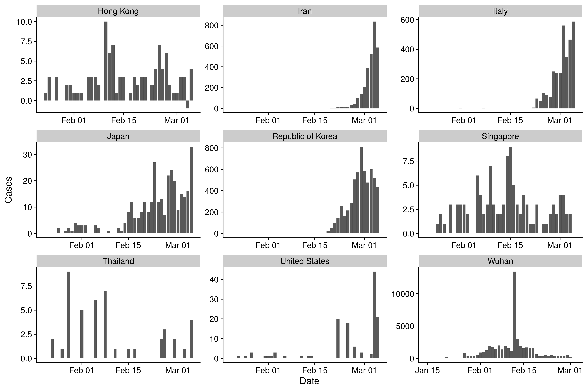
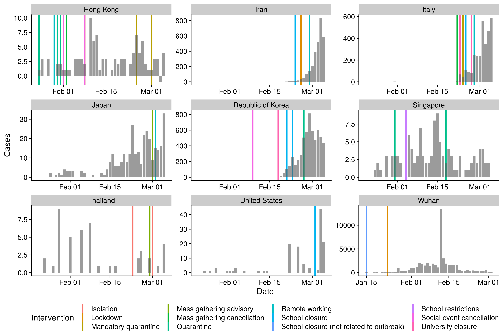
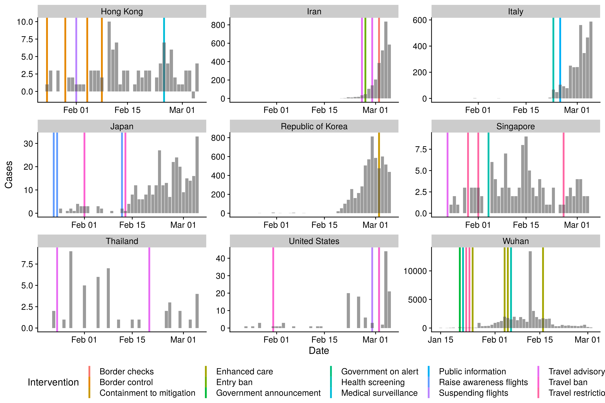

Package
-------

Extract variables of potential interest from linelist
-----------------------------------------------------

    ## Parsed with column specification:
    ## cols(
    ##   .default = col_character(),
    ##   ID = col_double(),
    ##   `wuhan(0)_not_wuhan(1)` = col_double(),
    ##   latitude = col_double(),
    ##   longitude = col_double(),
    ##   data_moderator_initials = col_logical(),
    ##   V34 = col_logical(),
    ##   V35 = col_logical(),
    ##   V36 = col_logical(),
    ##   V37 = col_logical(),
    ##   V38 = col_logical(),
    ##   V39 = col_logical(),
    ##   V40 = col_logical(),
    ##   V41 = col_logical()
    ## )

    ## See spec(...) for full column specifications.

    ## Warning: 656 parsing failures.
    ##  row                     col           expected actual                    file
    ## 5835 data_moderator_initials 1/0/T/F/TRUE/FALSE     SL 'raw-data/linelist.csv'
    ## 5836 data_moderator_initials 1/0/T/F/TRUE/FALSE     SL 'raw-data/linelist.csv'
    ## 5837 data_moderator_initials 1/0/T/F/TRUE/FALSE     SL 'raw-data/linelist.csv'
    ## 5838 data_moderator_initials 1/0/T/F/TRUE/FALSE     SL 'raw-data/linelist.csv'
    ## 5839 data_moderator_initials 1/0/T/F/TRUE/FALSE     SL 'raw-data/linelist.csv'
    ## .... ....................... .................. ...... .......................
    ## See problems(...) for more details.

    ## # A tibble: 14,619 x 6
    ##    country city       province date_confirmation travel_history_l… import_status
    ##    <chr>   <chr>      <chr>    <chr>             <chr>             <chr>        
    ##  1 China   Chaohu Ci… Anhui    22.01.2020        Wuhan             imported     
    ##  2 China   Baohe Dis… Anhui    23.01.2020        Luzhou Hunan, vi… imported     
    ##  3 China   High-Tech… Anhui    23.01.2020        Yinzhou Hunan, v… imported     
    ##  4 China   High-Tech… Anhui    23.01.2020        <NA>              local        
    ##  5 China   Feidong C… Anhui    23.01.2020        Wuhan             imported     
    ##  6 China   Lu'an City Anhui    24.01.2020        <NA>              local        
    ##  7 China   Fuyang Ci… Anhui    22.01.2020        Wuhan             imported     
    ##  8 China   Huaibei C… Anhui    25.01.2020        Wuhan             imported     
    ##  9 China   Huainan C… Anhui    26.01.2020        Wuhan             imported     
    ## 10 China   Hefei City Anhui    23.01.2020        Wuhan             imported     
    ## # … with 14,609 more rows

Estimate fraction that are imported
-----------------------------------

-   Based on linelist data alone. Only countries with at least 20 total
    cases present are shown.

-   Based on linelist data and WH0 sit reps

-   Summarise and report

<table>
<thead>
<tr class="header">
<th style="text-align: left;">Country</th>
<th style="text-align: right;">Cases</th>
<th style="text-align: right;">Fraction imported (linelist only)</th>
<th style="text-align: right;">Fraction imported (WHO sit reps)</th>
</tr>
</thead>
<tbody>
<tr class="odd">
<td style="text-align: left;">Vietnam</td>
<td style="text-align: right;">16</td>
<td style="text-align: right;">0.69</td>
<td style="text-align: right;">0.69</td>
</tr>
<tr class="even">
<td style="text-align: left;">Kuwait</td>
<td style="text-align: right;">58</td>
<td style="text-align: right;">1.00</td>
<td style="text-align: right;">0.64</td>
</tr>
<tr class="odd">
<td style="text-align: left;">Canada</td>
<td style="text-align: right;">30</td>
<td style="text-align: right;">0.75</td>
<td style="text-align: right;">0.50</td>
</tr>
<tr class="even">
<td style="text-align: left;">Bahrain</td>
<td style="text-align: right;">49</td>
<td style="text-align: right;">1.00</td>
<td style="text-align: right;">0.41</td>
</tr>
<tr class="odd">
<td style="text-align: left;">Netherlands</td>
<td style="text-align: right;">38</td>
<td style="text-align: right;">0.67</td>
<td style="text-align: right;">0.32</td>
</tr>
<tr class="even">
<td style="text-align: left;">Thailand</td>
<td style="text-align: right;">47</td>
<td style="text-align: right;">0.34</td>
<td style="text-align: right;">0.30</td>
</tr>
<tr class="odd">
<td style="text-align: left;">Singapore</td>
<td style="text-align: right;">110</td>
<td style="text-align: right;">0.34</td>
<td style="text-align: right;">0.29</td>
</tr>
<tr class="even">
<td style="text-align: left;">United Arab Emirates</td>
<td style="text-align: right;">27</td>
<td style="text-align: right;">0.35</td>
<td style="text-align: right;">0.26</td>
</tr>
<tr class="odd">
<td style="text-align: left;">Australia</td>
<td style="text-align: right;">66</td>
<td style="text-align: right;">0.88</td>
<td style="text-align: right;">0.23</td>
</tr>
<tr class="even">
<td style="text-align: left;">Malaysia</td>
<td style="text-align: right;">50</td>
<td style="text-align: right;">0.65</td>
<td style="text-align: right;">0.22</td>
</tr>
<tr class="odd">
<td style="text-align: left;">Iraq</td>
<td style="text-align: right;">36</td>
<td style="text-align: right;">0.44</td>
<td style="text-align: right;">0.22</td>
</tr>
<tr class="even">
<td style="text-align: left;">Japan</td>
<td style="text-align: right;">317</td>
<td style="text-align: right;">0.07</td>
<td style="text-align: right;">0.17</td>
</tr>
<tr class="odd">
<td style="text-align: left;">United States</td>
<td style="text-align: right;">129</td>
<td style="text-align: right;">0.50</td>
<td style="text-align: right;">0.16</td>
</tr>
<tr class="even">
<td style="text-align: left;">India</td>
<td style="text-align: right;">29</td>
<td style="text-align: right;">0.14</td>
<td style="text-align: right;">0.14</td>
</tr>
<tr class="odd">
<td style="text-align: left;">Spain</td>
<td style="text-align: right;">198</td>
<td style="text-align: right;">0.44</td>
<td style="text-align: right;">0.12</td>
</tr>
<tr class="even">
<td style="text-align: left;">United Kingdom</td>
<td style="text-align: right;">89</td>
<td style="text-align: right;">0.59</td>
<td style="text-align: right;">0.11</td>
</tr>
<tr class="odd">
<td style="text-align: left;">Germany</td>
<td style="text-align: right;">262</td>
<td style="text-align: right;">0.32</td>
<td style="text-align: right;">0.07</td>
</tr>
<tr class="even">
<td style="text-align: left;">Norway</td>
<td style="text-align: right;">56</td>
<td style="text-align: right;">0.25</td>
<td style="text-align: right;">0.07</td>
</tr>
<tr class="odd">
<td style="text-align: left;">France</td>
<td style="text-align: right;">282</td>
<td style="text-align: right;">0.20</td>
<td style="text-align: right;">0.03</td>
</tr>
<tr class="even">
<td style="text-align: left;">Italy</td>
<td style="text-align: right;">3089</td>
<td style="text-align: right;">0.02</td>
<td style="text-align: right;">0.00</td>
</tr>
<tr class="odd">
<td style="text-align: left;">South Korea</td>
<td style="text-align: right;">5766</td>
<td style="text-align: right;">0.02</td>
<td style="text-align: right;">0.00</td>
</tr>
<tr class="even">
<td style="text-align: left;">Austria</td>
<td style="text-align: right;">37</td>
<td style="text-align: right;">0.00</td>
<td style="text-align: right;">0.00</td>
</tr>
<tr class="odd">
<td style="text-align: left;">Iran</td>
<td style="text-align: right;">2922</td>
<td style="text-align: right;">0.00</td>
<td style="text-align: right;">0.00</td>
</tr>
<tr class="even">
<td style="text-align: left;">NA</td>
<td style="text-align: right;">NA</td>
<td style="text-align: right;">0.58</td>
<td style="text-align: right;">NA</td>
</tr>
</tbody>
</table>

Plot cases over time
--------------------

-   Wrangle for countries of interest (with at least 40 cases)

<!-- -->

    ## Parsed with column specification:
    ## cols(
    ##   date = col_date(format = ""),
    ##   country = col_character(),
    ##   cases = col_double()
    ## )

-   Get date of first report

<table>
<thead>
<tr class="header">
<th style="text-align: left;">Country</th>
<th style="text-align: left;">Date of first case report</th>
</tr>
</thead>
<tbody>
<tr class="odd">
<td style="text-align: left;">Wuhan</td>
<td style="text-align: left;">2020-01-15</td>
</tr>
<tr class="even">
<td style="text-align: left;">Republic of Korea</td>
<td style="text-align: left;">2020-01-20</td>
</tr>
<tr class="odd">
<td style="text-align: left;">Japan</td>
<td style="text-align: left;">2020-01-20</td>
</tr>
<tr class="even">
<td style="text-align: left;">Thailand</td>
<td style="text-align: left;">2020-01-20</td>
</tr>
<tr class="odd">
<td style="text-align: left;">Taiwan</td>
<td style="text-align: left;">2020-01-21</td>
</tr>
<tr class="even">
<td style="text-align: left;">United States</td>
<td style="text-align: left;">2020-01-23</td>
</tr>
<tr class="odd">
<td style="text-align: left;">Hong Kong</td>
<td style="text-align: left;">2020-01-23</td>
</tr>
<tr class="even">
<td style="text-align: left;">Singapore</td>
<td style="text-align: left;">2020-01-24</td>
</tr>
<tr class="odd">
<td style="text-align: left;">Italy</td>
<td style="text-align: left;">2020-01-31</td>
</tr>
<tr class="even">
<td style="text-align: left;">Iran</td>
<td style="text-align: left;">2020-02-20</td>
</tr>
</tbody>
</table>

-   Get case counts

-   Plot curves in countries of interest

<!-- -->

    ## Warning: Removed 11 rows containing missing values (position_stack).

Get interventions
-----------------

-   Plot overall interventions

<!-- -->

    ## Warning: Missing column names filled in: 'X8' [8]

    ## Parsed with column specification:
    ## cols(
    ##   date_intervention = col_date(format = ""),
    ##   intervention = col_character(),
    ##   social_distancing = col_character(),
    ##   country = col_character(),
    ##   notes = col_character(),
    ##   ref1 = col_character(),
    ##   ref2 = col_character(),
    ##   X8 = col_character()
    ## )

<table>
<thead>
<tr class="header">
<th style="text-align: left;">Intervention</th>
<th style="text-align: right;">Countries that have implemented</th>
</tr>
</thead>
<tbody>
<tr class="odd">
<td style="text-align: left;">Health screening</td>
<td style="text-align: right;">5</td>
</tr>
<tr class="even">
<td style="text-align: left;">School closure</td>
<td style="text-align: right;">5</td>
</tr>
<tr class="odd">
<td style="text-align: left;">Remote working</td>
<td style="text-align: right;">4</td>
</tr>
<tr class="even">
<td style="text-align: left;">Travel advisory</td>
<td style="text-align: right;">4</td>
</tr>
<tr class="odd">
<td style="text-align: left;">Government on alert</td>
<td style="text-align: right;">3</td>
</tr>
<tr class="even">
<td style="text-align: left;">Lockdown</td>
<td style="text-align: right;">3</td>
</tr>
<tr class="odd">
<td style="text-align: left;">Quarantine</td>
<td style="text-align: right;">3</td>
</tr>
<tr class="even">
<td style="text-align: left;">School closure (not related to outbreak)</td>
<td style="text-align: right;">3</td>
</tr>
<tr class="odd">
<td style="text-align: left;">Travel restriction</td>
<td style="text-align: right;">3</td>
</tr>
<tr class="even">
<td style="text-align: left;">Isolation</td>
<td style="text-align: right;">2</td>
</tr>
<tr class="odd">
<td style="text-align: left;">Mandatory quarantine</td>
<td style="text-align: right;">2</td>
</tr>
<tr class="even">
<td style="text-align: left;">Mass gathering advisory</td>
<td style="text-align: right;">2</td>
</tr>
<tr class="odd">
<td style="text-align: left;">Mass gathering cancellation</td>
<td style="text-align: right;">2</td>
</tr>
<tr class="even">
<td style="text-align: left;">School restrictions</td>
<td style="text-align: right;">2</td>
</tr>
<tr class="odd">
<td style="text-align: left;">Social event cancellation</td>
<td style="text-align: right;">2</td>
</tr>
<tr class="even">
<td style="text-align: left;">Suspending flights</td>
<td style="text-align: right;">2</td>
</tr>
<tr class="odd">
<td style="text-align: left;">Travel ban</td>
<td style="text-align: right;">2</td>
</tr>
<tr class="even">
<td style="text-align: left;">University closure</td>
<td style="text-align: right;">2</td>
</tr>
<tr class="odd">
<td style="text-align: left;">Work closure (not related to outbreak)</td>
<td style="text-align: right;">2</td>
</tr>
<tr class="even">
<td style="text-align: left;">[Extension] school and work closure</td>
<td style="text-align: right;">1</td>
</tr>
<tr class="odd">
<td style="text-align: left;">Border checks</td>
<td style="text-align: right;">1</td>
</tr>
<tr class="even">
<td style="text-align: left;">Border control</td>
<td style="text-align: right;">1</td>
</tr>
<tr class="odd">
<td style="text-align: left;">Communication distancing</td>
<td style="text-align: right;">1</td>
</tr>
<tr class="even">
<td style="text-align: left;">Communication general</td>
<td style="text-align: right;">1</td>
</tr>
<tr class="odd">
<td style="text-align: left;">Contact tracing</td>
<td style="text-align: right;">1</td>
</tr>
<tr class="even">
<td style="text-align: left;">Containment to mitigation</td>
<td style="text-align: right;">1</td>
</tr>
<tr class="odd">
<td style="text-align: left;">Decontamination</td>
<td style="text-align: right;">1</td>
</tr>
<tr class="even">
<td style="text-align: left;">Enhanced care</td>
<td style="text-align: right;">1</td>
</tr>
<tr class="odd">
<td style="text-align: left;">Entry ban</td>
<td style="text-align: right;">1</td>
</tr>
<tr class="even">
<td style="text-align: left;">Government announcement</td>
<td style="text-align: right;">1</td>
</tr>
<tr class="odd">
<td style="text-align: left;">Healthcare restrictions</td>
<td style="text-align: right;">1</td>
</tr>
<tr class="even">
<td style="text-align: left;">Mass gathering ban</td>
<td style="text-align: right;">1</td>
</tr>
<tr class="odd">
<td style="text-align: left;">Medical surveillance</td>
<td style="text-align: right;">1</td>
</tr>
<tr class="even">
<td style="text-align: left;">Prevention measures school</td>
<td style="text-align: right;">1</td>
</tr>
<tr class="odd">
<td style="text-align: left;">Public information</td>
<td style="text-align: right;">1</td>
</tr>
<tr class="even">
<td style="text-align: left;">Raise awareness flights</td>
<td style="text-align: right;">1</td>
</tr>
<tr class="odd">
<td style="text-align: left;">Raise awareness healthcare staff</td>
<td style="text-align: right;">1</td>
</tr>
<tr class="even">
<td style="text-align: left;">Raise awareness public</td>
<td style="text-align: right;">1</td>
</tr>
<tr class="odd">
<td style="text-align: left;">Reduced shop hours</td>
<td style="text-align: right;">1</td>
</tr>
<tr class="even">
<td style="text-align: left;">Resumption public services</td>
<td style="text-align: right;">1</td>
</tr>
<tr class="odd">
<td style="text-align: left;">Social distancing misc</td>
<td style="text-align: right;">1</td>
</tr>
<tr class="even">
<td style="text-align: left;">Strengthening primary care response</td>
<td style="text-align: right;">1</td>
</tr>
<tr class="odd">
<td style="text-align: left;">Supply</td>
<td style="text-align: right;">1</td>
</tr>
<tr class="even">
<td style="text-align: left;">Surveillance</td>
<td style="text-align: right;">1</td>
</tr>
<tr class="odd">
<td style="text-align: left;">Travel advice</td>
<td style="text-align: right;">1</td>
</tr>
</tbody>
</table>

-   Social interventions only

<table>
<thead>
<tr class="header">
<th style="text-align: left;">Intervention</th>
<th style="text-align: right;">Countries that have implemented</th>
</tr>
</thead>
<tbody>
<tr class="odd">
<td style="text-align: left;">School closure</td>
<td style="text-align: right;">5</td>
</tr>
<tr class="even">
<td style="text-align: left;">Remote working</td>
<td style="text-align: right;">4</td>
</tr>
<tr class="odd">
<td style="text-align: left;">Lockdown</td>
<td style="text-align: right;">3</td>
</tr>
<tr class="even">
<td style="text-align: left;">Quarantine</td>
<td style="text-align: right;">3</td>
</tr>
<tr class="odd">
<td style="text-align: left;">School closure (not related to outbreak)</td>
<td style="text-align: right;">3</td>
</tr>
<tr class="even">
<td style="text-align: left;">Isolation</td>
<td style="text-align: right;">2</td>
</tr>
<tr class="odd">
<td style="text-align: left;">Mandatory quarantine</td>
<td style="text-align: right;">2</td>
</tr>
<tr class="even">
<td style="text-align: left;">Mass gathering advisory</td>
<td style="text-align: right;">2</td>
</tr>
<tr class="odd">
<td style="text-align: left;">Mass gathering cancellation</td>
<td style="text-align: right;">2</td>
</tr>
<tr class="even">
<td style="text-align: left;">School restrictions</td>
<td style="text-align: right;">2</td>
</tr>
<tr class="odd">
<td style="text-align: left;">Social event cancellation</td>
<td style="text-align: right;">2</td>
</tr>
<tr class="even">
<td style="text-align: left;">University closure</td>
<td style="text-align: right;">2</td>
</tr>
<tr class="odd">
<td style="text-align: left;">Work closure (not related to outbreak)</td>
<td style="text-align: right;">2</td>
</tr>
<tr class="even">
<td style="text-align: left;">[Extension] school and work closure</td>
<td style="text-align: right;">1</td>
</tr>
<tr class="odd">
<td style="text-align: left;">Communication distancing</td>
<td style="text-align: right;">1</td>
</tr>
<tr class="even">
<td style="text-align: left;">Contact tracing</td>
<td style="text-align: right;">1</td>
</tr>
<tr class="odd">
<td style="text-align: left;">Healthcare restrictions</td>
<td style="text-align: right;">1</td>
</tr>
<tr class="even">
<td style="text-align: left;">Mass gathering ban</td>
<td style="text-align: right;">1</td>
</tr>
<tr class="odd">
<td style="text-align: left;">Prevention measures school</td>
<td style="text-align: right;">1</td>
</tr>
<tr class="even">
<td style="text-align: left;">Reduced shop hours</td>
<td style="text-align: right;">1</td>
</tr>
<tr class="odd">
<td style="text-align: left;">Social distancing misc</td>
<td style="text-align: right;">1</td>
</tr>
<tr class="even">
<td style="text-align: left;">Travel advice</td>
<td style="text-align: right;">1</td>
</tr>
<tr class="odd">
<td style="text-align: left;">Travel restriction</td>
<td style="text-align: right;">1</td>
</tr>
</tbody>
</table>

-   Non-social interventions

<table>
<thead>
<tr class="header">
<th style="text-align: left;">Intervention</th>
<th style="text-align: right;">Countries that have implemented</th>
</tr>
</thead>
<tbody>
<tr class="odd">
<td style="text-align: left;">Health screening</td>
<td style="text-align: right;">5</td>
</tr>
<tr class="even">
<td style="text-align: left;">Travel advisory</td>
<td style="text-align: right;">4</td>
</tr>
<tr class="odd">
<td style="text-align: left;">Government on alert</td>
<td style="text-align: right;">3</td>
</tr>
<tr class="even">
<td style="text-align: left;">Travel restriction</td>
<td style="text-align: right;">3</td>
</tr>
<tr class="odd">
<td style="text-align: left;">Suspending flights</td>
<td style="text-align: right;">2</td>
</tr>
<tr class="even">
<td style="text-align: left;">Travel ban</td>
<td style="text-align: right;">2</td>
</tr>
<tr class="odd">
<td style="text-align: left;">Border checks</td>
<td style="text-align: right;">1</td>
</tr>
<tr class="even">
<td style="text-align: left;">Border control</td>
<td style="text-align: right;">1</td>
</tr>
<tr class="odd">
<td style="text-align: left;">Communication general</td>
<td style="text-align: right;">1</td>
</tr>
<tr class="even">
<td style="text-align: left;">Containment to mitigation</td>
<td style="text-align: right;">1</td>
</tr>
<tr class="odd">
<td style="text-align: left;">Decontamination</td>
<td style="text-align: right;">1</td>
</tr>
<tr class="even">
<td style="text-align: left;">Enhanced care</td>
<td style="text-align: right;">1</td>
</tr>
<tr class="odd">
<td style="text-align: left;">Entry ban</td>
<td style="text-align: right;">1</td>
</tr>
<tr class="even">
<td style="text-align: left;">Government announcement</td>
<td style="text-align: right;">1</td>
</tr>
<tr class="odd">
<td style="text-align: left;">Medical surveillance</td>
<td style="text-align: right;">1</td>
</tr>
<tr class="even">
<td style="text-align: left;">Public information</td>
<td style="text-align: right;">1</td>
</tr>
<tr class="odd">
<td style="text-align: left;">Raise awareness flights</td>
<td style="text-align: right;">1</td>
</tr>
<tr class="even">
<td style="text-align: left;">Raise awareness healthcare staff</td>
<td style="text-align: right;">1</td>
</tr>
<tr class="odd">
<td style="text-align: left;">Raise awareness public</td>
<td style="text-align: right;">1</td>
</tr>
<tr class="even">
<td style="text-align: left;">Resumption public services</td>
<td style="text-align: right;">1</td>
</tr>
<tr class="odd">
<td style="text-align: left;">Strengthening primary care response</td>
<td style="text-align: right;">1</td>
</tr>
<tr class="even">
<td style="text-align: left;">Supply</td>
<td style="text-align: right;">1</td>
</tr>
<tr class="odd">
<td style="text-align: left;">Surveillance</td>
<td style="text-align: right;">1</td>
</tr>
<tr class="even">
<td style="text-align: left;">Travel advice</td>
<td style="text-align: right;">1</td>
</tr>
</tbody>
</table>

-   Plot social interventions

<!-- -->

    ## Warning: Removed 11 rows containing missing values (position_stack).

-   Plot non-social interventions

<!-- -->

    ## Warning: Removed 11 rows containing missing values (position_stack).

